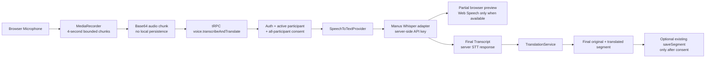

# LINGUA X — Phase 3A

## الغرض والنطاق

تنفذ Phase 3A مسارًا صوتيًا قصيرًا من متصفح الاجتماع إلى النص النهائي والترجمة:

> **Microphone → Audio Stream → Speech-to-Text Provider → Partial Transcript → Final Transcript → Translation Engine**

النطاق محصور في التقاط ميكروفون مستخدم واحد داخل اجتماع مصادق عليه. لا تتضمن المرحلة WebRTC أو الصوت متعدد المشاركين أو WhatsApp أو ذكاء الاجتماع أو أي تشغيل خلفي.

## المعمارية



العميل يستخدم `useAudioPipeline` لطلب إذن الميكروفون، وإنشاء `MediaRecorder`، وتجميع مقطع واحد في كل مرة. يمنع الـhook الطلبات المتوازية؛ لا يبدأ المقطع التالي حتى تنتهي معالجة المقطع السابق. النص الجزئي المعروض في الواجهة هو preview محلي من `SpeechRecognition` في المتصفحات التي تدعمه، وليس نتيجة STT الخادمية ولا يُحفظ. النص النهائي لا يضاف إلى قائمة الاجتماع إلا بعد نجاح STT ثم `TranslationService`.

## عقد API

يُستهلك العقد عبر tRPC تحت المسار الفعلي `/api/trpc/voice.transcribeAndTranslate`، وتوجد namespace `voice` في `server/routers.ts`. الإجراء `protectedProcedure` ولا يقبل هوية أو ownership من العميل.

| الحقل            | النوع  | القيد أو الغرض                                                                    |
| ---------------- | ------ | --------------------------------------------------------------------------------- |
| `inviteCode`     | string | رمز الاجتماع، يُطبع uppercase، من 4 إلى 16 حرفًا                                  |
| `audioBase64`    | string | chunk مشفر Base64، حد الإدخال 8,000,000 محرف تقريبًا، والحد الفعلي للـbuffer 16MB |
| `mimeType`       | enum   | `audio/webm`, `audio/mp4`, `audio/m4a`, `audio/mpeg`, `audio/ogg`, `audio/wav`    |
| `sourceLanguage` | string | لغة الحديث، من حرفين إلى 16 حرفًا                                                 |
| `targetLanguage` | string | لغة الترجمة، من حرفين إلى 16 حرفًا                                                |

يعيد الإجراء `originalText` و`translatedText` و`detectedLanguage` و`durationSeconds` و`segments` المختصرة و`provider` و`model`. لا يعيد الصوت ولا مفتاح مزود الخدمة.

## التفويض والخصوصية

قبل قراءة أو إرسال bytes الصوت، يتحقق الخادم من أن الجلسة موجودة وأن المستخدم الحالي عضو نشط فيها. ثم يشترط `isMeetingPersistenceAllowed`، أي موافقة جميع المشاركين النشطين وفق سياسة الصوت القائمة في المشروع. إذا لم تكتمل الموافقة، يعيد endpoint `PRECONDITION_FAILED` ولا يستدعي STT.

لا يخزن `voice.transcribeAndTranslate` الصوت الخام ولا يرفعه إلى S3. بعد نجاح النتيجة، قد تستدعي واجهة Meeting الإجراء الموجود `meetings.saveSegment` لحفظ النص النهائي فقط عندما يسمح فحص الموافقة؛ وهذا مسار منفصل عن معالجة chunk. لا تُكتب bytes الصوت أو النصوص الحساسة إلى logs.

## طبقة المزود

يعتمد router على `SpeechService` في `server/services/speechToTextService.ts` بدل استدعاء vendor مباشرة. يحتوي هذا الحد على `SpeechProvider` و`SpeechProviderRegistry` و`FallbackSpeechProvider`، وهي تمثل STT A/B في التصميم. يقرأ الترتيب من `STT_PROVIDER`، ولا يسمح إلا بالمزودين المسجلين. التنفيذ الإنتاجي المسجل حاليًا هو `ManusWhisperSpeechProvider` الذي يمرر الطلب إلى `transcribeAudioBuffer` في `server/_core/voiceTranscription.ts` باستخدام endpoint الخادمي `v1/audio/transcriptions` ونموذج `whisper-1`. يمكن إضافة مزود STT B إلى registry أو استبدال implementation لاحقًا دون تعديل عقد router أو واجهة Meeting.

الترجمة تمر فقط عبر `TranslationService` و`TranslationProvider` الحاليين؛ لا يستدعي مسار الصوت LLM vendor مباشرة من العميل.

## الفشل والتعامل معه

تُحوّل أخطاء المزود إلى أخطاء تطبيقية لا تعيد body المزود أو exception text. تشمل التغطية `FILE_TOO_LARGE`، و`INVALID_FORMAT`، و`AUTHENTICATION_FAILED` لحالتي 401/403، و`RATE_LIMITED` لحالة 429، و`TIMEOUT`، و`NETWORK_FAILURE`، و`MALFORMED_RESPONSE`. عند توفر `Retry-After` من مزود STT يُمرر للخارج كقيمة ثوانٍ رقمية في HTTP header، دون كشف أي نص إضافي.

مهلة طلب STT هي 20 ثانية. لا يوجد اختبار مزود حي ضمن الاختبارات؛ الاختبارات تستخدم mocks deterministic وتتحقق من العقد والتحويلات والحالات الفاشلة. يلزم توفر `BUILT_IN_FORGE_API_URL` و`BUILT_IN_FORGE_API_KEY` في بيئة التشغيل لنجاح STT الفعلي، وتبقى هذه القيم server-side فقط.

## متطلبات المتصفح والقيود

يتطلب المسار دعم `navigator.mediaDevices.getUserMedia` و`MediaRecorder` وإذن الميكروفون [2] [3]. اختيار MIME يبدأ بـ`audio/webm` ثم يستخدم `audio/mp4` كخيار بديل، ولا يوجد ضمان موحد لدعم كل الصيغ في كل المتصفحات. توفر `SpeechRecognition` اختياري لتحسين partial preview؛ عدم توفره لا يمنع إرسال الصوت إلى STT، لكنه يعني عدم ظهور preview محلي قبل final.

المقطع الافتراضي 4 ثوانٍ، والـhook يوقف التسجيل بأمان وينظف tracks والمؤقتات والمُعرّف عند الإيقاف أو unmount. يظل ذلك chunked upload إلى tRPC، وليس WebRTC أو بثًا متعدد المشاركين.

## الاختبار deterministic وLive Smoke Test

تستخدم الاختبارات الآلية `DeterministicSpeechToTextProvider` الموجود تحت `server/testUtils/` فقط. هذا المزود يطبق `SpeechProvider`، ويعيد response ثابتًا ولا يتصل بالشبكة ولا يقرأ credentials، وهو مخصص للاختبارات ولا يُسجل في Registry production.

يجهز السكربت `scripts/stt-live-smoke.ts` لتشغيل provider المهيأ فعليًا عند توفر إعدادات حقيقية. لا يضع السكربت أي default audio أو credential؛ ويطبع صراحة `REAL PROVIDER TEST = NOT RUN — CREDENTIALS NOT CONFIGURED` عند غياب `BUILT_IN_FORGE_API_URL` أو `BUILT_IN_FORGE_API_KEY`. عند التشغيل، يجب تمرير ملف صوت حقيقي عبر `STT_SMOKE_AUDIO_FILE`، ويمكن تحديد MIME صراحة عبر `STT_SMOKE_MIME_TYPE`، ثم تشغيل:

```bash
STT_SMOKE_AUDIO_FILE=/path/to/real-fixture.webm pnpm stt:smoke
```

يجرب السكربت اللغات `ar` و`es` و`en`، ويعرض اسم المزود ونتيجة كل لغة ووقت final transcript بالميلي ثانية دون طباعة النص نفسه. قيمة `firstPartialLatencyMs` تكون `null` حاليًا لأن `manus-whisper` عبر `v1/audio/transcriptions` هو chunk provider غير streaming ولا يعرض partial events؛ ستُقاس هذه القيمة فقط بعد إضافة SpeechProvider يدعم streaming events. لا تُخترع أرقام latency أو success.

## الملفات المنفذة

| الملف                                         | الدور                                                             |
| --------------------------------------------- | ----------------------------------------------------------------- |
| `server/routers/voice.ts`                     | عقد tRPC والتفويض وربط STT بالترجمة                               |
| `server/services/speechToTextService.ts`      | provider interface وManus Whisper adapter                         |
| `server/_core/voiceTranscription.ts`          | HTTP STT helper والمهلة وتطبيع استجابات المزود                    |
| `client/src/hooks/useAudioPipeline.ts`        | microphone، MediaRecorder، partial preview، backpressure، cleanup |
| `client/src/pages/Meeting.tsx`                | عرض partial وإضافة final transcript + translation                 |
| `server/routers/voice.test.ts`                | flow وauth/membership/consent/rate-limit contract tests           |
| `server/services/speechToTextService.test.ts` | provider mapping tests                                            |
| `server/_core/voiceTranscription.test.ts`     | HTTP/error/size/security tests                                    |

## References

[1]: https://github.com/gadm664-max/linguabridge-private "LinguaBridge private repository"
[2]: https://developer.mozilla.org/en-US/docs/Web/API/MediaRecorder "MDN MediaRecorder API"
[3]: https://developer.mozilla.org/en-US/docs/Web/API/MediaDevices/getUserMedia "MDN getUserMedia API"
